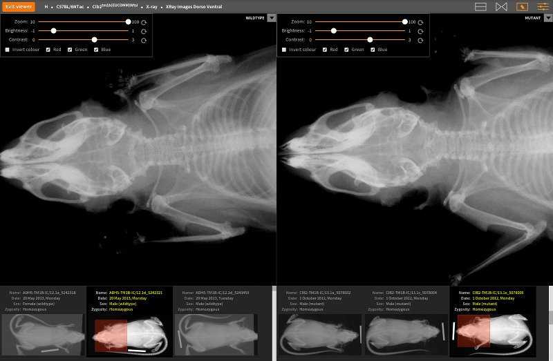

# Design of Image Viewer

The _image viewer_ allows biologists to observe phenotypic variation
between mutants and wildtypes as a result of genetic mutations. It
supports side-by-side comparison of images that belong to mutants and
wildtypes (for instance, the variation in skeletal structure as made
visible through X-ray images).

The _image viewer_ has the following functional requirements:

* It should allow switching between _single image view_ mode, where
  the viewer displays one image at a time, and _comparative image
  view_ mode, where the viewer displays two images side-by-side for
  comparison.

* It should allow users to zoom in and out.

* It should allow users to pan by dragging the image, or by dragging a
  region-of-interest selector.

* It should allow users to interact with the images by controlling its
  brightness and contrast, and through colour inversion.

* The design should allow additional facilities to be added later.

The _image viewer_ has two main design requirements:

* **It must be embeddable** External web applications should be
    allowed to embed the image viewer.

* **Use image tiles** For efficient delivery of high-resolution
    images, the viewer must use on-demand loading of thumbnails and
    image tiles. These tiles are generate by the _processing scripts_
    that reside in the `processing` directory at the project root.

## Main components

An `ImageViewer` object handles the image display and rendering
controls. It encapsulates an image selector (where, there are multiple
images), display of image tiles that are associated with the selected 
image, and controls that alter the rendering of these image tiles.

Image tiles are rendered as layers, encapsulated by the `Layer`
object. An `ImageViewer` object can display multiple layers
simultaneously. A `Layer` object is a two-dimensional grid of image
cells, which is large enough to accommodate the entire image at the
selected scale. The grid of canvases is encapsulated by an
`ImageTileGrid` object. Each of these cells is used for rendering
image tiles using the current control setting (e.g., brightness and
contrast).

To support on demand loading and rendering of images, the image viewer
tests the visibility of tiles using a `Viewport` object. This object
represents the visible area of the image. Only tiles that are visible
are rendered on the `Layer` canvas. The viewport visibility test is
carried out whenever the image viewer controls are altered. This
allows efficient rendering of visible tiles on the canvas.

The `ViewControl` object encapsulates the rendering control. Every
`ImageViewer` object is associated with a dedicated control, and only
that control has the right to alter the rendering on that viewer.

When there are multiple images, a viewer displays a list of thumbnails
that the user can select. When a thumbnail is selected, a
region-of-interest selector is displayed on top of the selected
thumbnail. This is encapsulated by the `RegionOfInterestSelector`
object. The region-of-interest selector corresponds to the viewport,
and adapts accordingly when the viewport changes due to panning and
zooming. A user can drag on the region-of-interest selector to alter
the viewport.

Finally, two image viewers can be initialised for side-by-side
comparison using a `ComparativeImageViewer` object. The comparative
image viewer is associated with a toolbar that provides additional
controls to alter the behaviour of both image viewers. This toolbar
also provides the facility to display titles etc. The toolbar is
encapsulated by a `ViewerToolbar` object.

## Side-by-side comparison of images

The comparative image viewer takes the following configurations:

* `title` - The supplied title is displayed on the toolbar.

* `splitType` - This can take one of the following values: `vertical`
   or `horizontal`. If unspecified, the image viewer will start in the
   _single image view_ mode.

* `exitHandler` - A function that will be invoked when the user clicks
   on the 'Exit viewer' button on the toolbar.

* `toolbar` - It is possible to use an external toolbar container. If
   specified, the toolbar controls will be rendered inside this
   container.

* `host` - This is the location of the image host server, where all of
   the thumbnails and image tiles are made available.

For example, the following embeds a comparative image viewer that
splits the screen horizontally, and displays mutant and wildtype images
side-by-side for the `<cid, gid, sid, pid, qid, lid>` data context.

    var comparative = new dcc.ComparativeImageViewer('image-viewer',
        {
            'title': 'Example comparative viewer',
            'splitType': 'horizontal',
            'exitHandler': function() {
                alert('Will exit viewer');
            }
        });
    comparative.view(cid, gid, sid, pid, qid, lid);

In the above example, the data context is defined by the following
arguments to `view()`:

* `cid` - Centre identifier
* `gid` - Genotype identifier
* `sid` - Background strain identifier
* `pid` - Experimental procedure identifier
* `qid` - Parameter to display for the experimental procedure
* `lid` - Optional argument that specifies the experimental pipeline
  (identifies a selection of experimental procedures).

