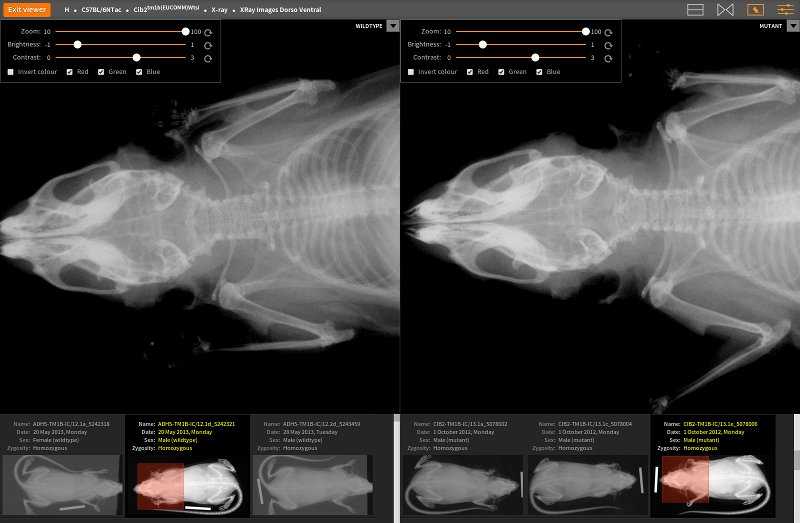

# The Image Viewer

The _image viewer_ allows biologists to observe phenotypic variation
between mutants and wildtypes as a result of genetic mutations. It
supports side-by-side comparison of images that belong to mutants and
wildtypes (for instance, the variation in skeletal structure as made
visible through X-ray images).

